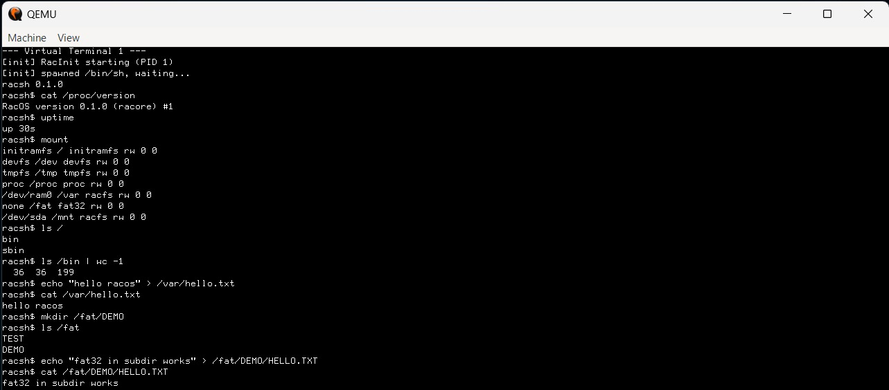
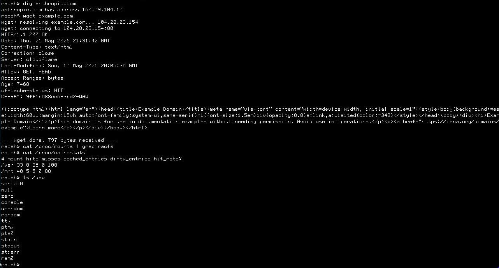

# RacOS

**Autorski system operacyjny z architekturą warstwową inspirowaną Ubuntu.**

RacOS to w pełni autorski system operacyjny budowany od zera — bez kopiowania kodu Linux, Ubuntu, Debian ani GNU. Architektura wzoruje się na logicznym modelu warstwowym: boot → kernel → user space → init/usługi → pakietowanie → shell → terminal → narzędzia systemowe.

## Demo



*RacOS bootuje przez własny init do `racsh`, a następnie pokazuje swój userland w akcji: tablica mountów (initramfs + devfs + tmpfs + procfs + dwa writable FS), 36 binarek w `/bin`, oraz pełen round-trip create+write+read na obu writable filesystemach — `racfs` na ramdisku i `FAT32` na drugim ramdisku, włącznie z podkatalogami (`/fat/DEMO/HELLO.TXT`). Cała ścieżka VFS → mount table → fork+exec → pipe '`>`' to własna implementacja.*



*Własny stack sieciowy end-to-end: `dig anthropic.com` rozwiązuje DNS (160.79.104.10), `wget example.com` rozkłada się na ARP do gateway, DNS query do 10.0.2.3, TCP three-way handshake do 104.20.23.154:80, HTTP/1.0 GET i parsing pełnej odpowiedzi z Cloudflare (status line + wszystkie headers + raw HTML body). Każdy bajt protokołów ARP / IPv4 / UDP / DNS / TCP / HTTP jest w tym repo — bez third-party crate'a do sieci.*

## Komponenty

| Komponent | Nazwa | Opis |
|-----------|-------|------|
| Kernel | **RaCore** | Modular monolithic kernel w Rust + x86_64 ASM |
| Init/Service Manager | **RacInit** | Autorski init z dependency graph, restart policy, unit files |
| Shell | **racsh** | Powłoka systemowa z AST-based parserem, job control, scripting |
| Terminal | **RacTerm** | Emulator terminala z ANSI/VT, PTY, scrollback, dirty rendering |
| Pkg (low-level) | **rpkg** | Lokalny instalator pakietów, baza plików, hooki |
| Pkg (high-level) | **rapt** | Resolver zależności, repozytoria, kanały, bezpieczne aktualizacje |

## Platforma

- **Architektura CPU**: x86_64
- **Firmware**: UEFI
- **Środowisko**: QEMU/KVM
- **Boot**: UEFI → bootloader → kernel ELF64 + initramfs

## Stos technologiczny

- **Kernel (RaCore)**: Rust `#![no_std]` + minimalny x86_64 assembly (boot stub, syscall entry, AP trampoline, context switch). Pełna lista invariantów w [`docs/language-policy.md`](docs/language-policy.md).
- **Bootloader**: Rust `x86_64-unknown-uefi`.
- **Userland (coreutils + sieć + shell + terminal + init)**: Rust `#![no_std]` na top of `libc-lite` (autorska crate na raw `syscall` instrukcji). Dziewięć pure-safe binaries (`true`, `false`, `df`, `env`, `id`, `mount`, `sync`, `sh`, `init`) ma `#![deny(unsafe_code)]` z lokalnym `#[allow(unsafe_code)]` tylko na `#[no_mangle]` C-ABI entry point.
- **C kompatybilność**: warstwa ABI (`libc-lite` C ABI surface) jest jedynym miejscem gdzie C może być używane — głównie do testów ABI i przyszłych portów userland. Kernel i bootloader **nie są** pisane w C ani C++.
- **Toolchain**: Rust nightly **przypięta do daty** (`nightly-2026-05-21`) przez `rust-toolchain.toml`. Bumpować dopiero po zielonym przebiegu `cargo fmt --check`, `cargo clippy`, `cargo check`, ci-smoke i interactive QEMU boot na nowej dacie.
- **Build**: cargo + `-Z build-std=core,alloc -Z build-std-features=compiler-builtins-mem`, link via rust-lld, PowerShell scripts do staging ESP i initramfs.
- **CI**: GitHub Actions — lint (fmt + clippy advisory) → build (kernel + bootloader + userland) → unit/integration tests (host) → kernel smoke przez `isa-debug-exit` → boot smoke (UEFI) → interactive shell smoke przez TCP-serial.

## Struktura repozytorium

```
/RacOS
  /boot          — bootloader i boot flow
  /kernel        — jądro RaCore
    /arch/x86_64 — kod architektoniczny
    /mm          — zarządzanie pamięcią
    /sched       — scheduler
    /task        — model procesów
    /syscall     — syscall ABI
    /ipc         — IPC, sygnały, pipe
    /vfs         — Virtual File System
    /fs          — systemy plików
    /drivers     — sterowniki
    /net         — sieć
    /security    — moduły bezpieczeństwa
    /time        — zegary i timery
    /debug       — debug infrastructure
  /init          — RacInit service manager
  /libs          — biblioteki systemowe
  /userland      — narzędzia użytkownika
  /shell         — racsh
  /terminal      — RacTerm
  /pkg           — rpkg + rapt + repo-tools
  /services      — definicje usług systemowych
  /images        — obrazy systemu
  /scripts       — skrypty pomocnicze
  /toolchain     — konfiguracja narzędzi
  /docs          — dokumentacja
  /tests         — testy
  /ci            — konfiguracja CI/CD
```

## Quick start

- **Linux**: see [docs/DEVELOPMENT_LINUX.md](docs/DEVELOPMENT_LINUX.md)
- **Windows**: see [docs/DEVELOPMENT_WINDOWS.md](docs/DEVELOPMENT_WINDOWS.md)

Both guides walk you through toolchain install, build, and booting RacOS in
QEMU.

## Dokumentacja

- [ARCHITECTURE.md](docs/architecture/ARCHITECTURE.md) — architektura systemu
- [BOOT_FLOW.md](docs/specs/BOOT_FLOW.md) — flow rozruchu
- [KERNEL_ABI.md](docs/specs/KERNEL_ABI.md) — ABI jądra
- [SYSCALL_SPEC.md](docs/specs/SYSCALL_SPEC.md) — specyfikacja wywołań systemowych
- [SERVICE_MODEL.md](docs/specs/SERVICE_MODEL.md) — model usług
- [SHELL_GRAMMAR.md](docs/specs/SHELL_GRAMMAR.md) — gramatyka shella
- [TERMINAL_PROTOCOLS.md](docs/specs/TERMINAL_PROTOCOLS.md) — protokoły terminala
- [PACKAGE_FORMAT.md](docs/specs/PACKAGE_FORMAT.md) — format pakietów
- [SECURITY_MODEL.md](docs/specs/SECURITY_MODEL.md) — model bezpieczeństwa
- [RELEASE_POLICY.md](docs/specs/RELEASE_POLICY.md) — polityka wydań
- [TEST_STRATEGY.md](docs/specs/TEST_STRATEGY.md) — strategia testów
- [ADRs](docs/adr/) — Architecture Decision Records

## Licencja

Licensed under the **Apache License, Version 2.0** — see [LICENSE](LICENSE) for the
full text. Copyright © 2026 RaCzKoViC.

You may use, modify, and distribute this software under the terms of the
license. See <http://www.apache.org/licenses/LICENSE-2.0> for details.
